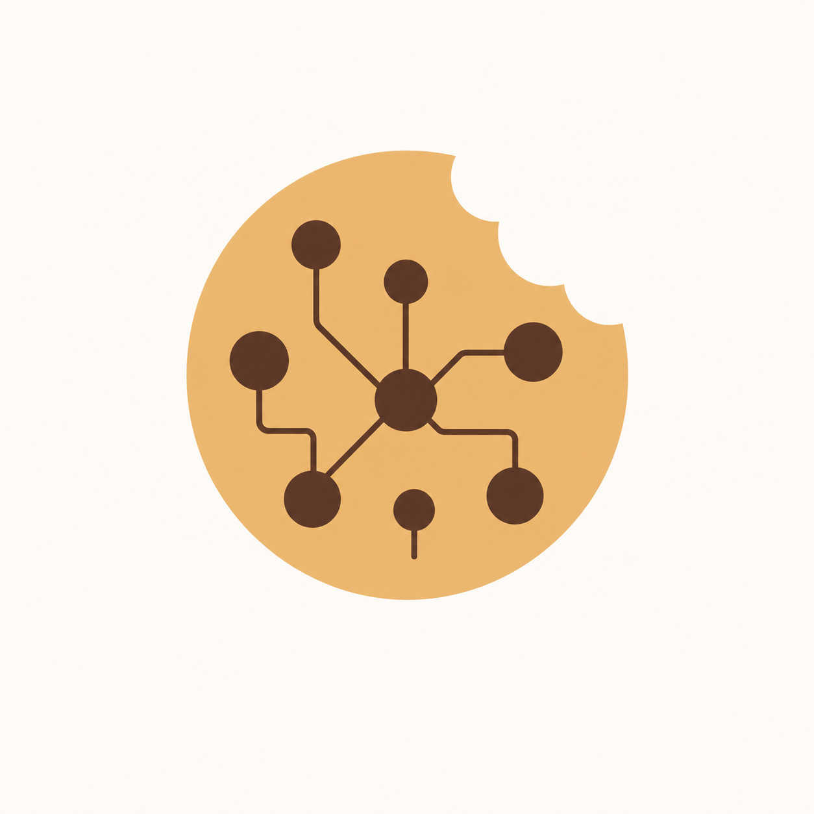

# cookie agent

<p align="center"></p>

Subagent-first coding harness.

[](https://cookie-agent.github.io/cookie-agent/)

## Documentation

The versioned user guide, protocol reference, and Rust API documentation are at
[cookie-agent.github.io/cookie-agent](https://cookie-agent.github.io/cookie-agent/).

The authoritative contract is [ARCHITECTURE.md](ARCHITECTURE.md). Exact schema
and runtime behavior are in
[docs/agent-model-variant-redesign.md](docs/agent-model-variant-redesign.md), and
the implemented npm-family/provider/auth baseline is described in
[docs/provider-conformance.md](docs/provider-conformance.md).

## Versioned protocol and stores

| Surface | Version |
|---|---:|
| Protocol | 9 |
| Events and session JSONL | 14 |
| Session metadata | 9 |
| Delegation journal | 10 |
| Runtime snapshot | 4 |
| Catalog cache | 2 |
| Provider store | 3 |
| Family recipe registry | 1 |
| Project model-snapshot manifest | 1 |

User-authored configuration and agent documents are unversioned and parsed
strictly. Unknown or leftover schema fields are hard errors with no migrations.

## Dynamic catalog

Every startup requests exactly `https://models.dev/catalog.json`. Resolution is
network, validated secure ETag cache, then bundled bootstrap. The selected
revision is `sha256:<lowercase SHA-256 digest of the exact selected body bytes>`.
Structurally invalid candidates
fall through; malformed provider/model records in a bounded structurally valid
candidate are quarantined independently so valid siblings remain usable.

On Unix, catalog cache schema 2 is fixed below
`~/.local/share/cookie_agent/catalog/`. Directories are private `0700`; body,
metadata, lock, and temporary files are current-user-owned `0600` regular
single-link files handled no-follow and atomically. The metadata records stale/
fallback state, safe last error, ETag, timestamps, revision, and quarantine
counts.

## Configuration

There is one top-level `providers` map; nonempty entries use
`[providers.<id>]`:

- `source = "models_dev"` uses optional `base_url`, separate typed `setup`,
  `api_key`, credential-only `auth_override`, and sparse `model_overrides`;
- `source = "custom"` uses required `endpoint`, `adaptor`, `auth`, and explicit
  complete `models`, plus separate optional adapter `setup` and `headers`.
  Custom IDs start with `custom.`.

Same-ID workspace definitions atomically replace user definitions; fields do
not merge. Managed models are automatic: every family-supported,
non-deprecated text-output model is included unless disabled by a sparse
override.

Agent Markdown documents use strict YAML frontmatter. Their `mode` is `primary`,
`subagent`, `all`, or `internal`. Internal agents are engine-only: they cannot be
selected as roots or delegation targets and do not appear in TUI agent pickers.
The runtime supplies built-in `approval`, `compaction`, and `title` internal
documents; `.cookie-agent/agents/approval.md`, `compaction.md`, or `title.md`
replace those defaults normally. Internal documents may use `${parent_model}` in
`models` to inherit the parent run's exact frozen model and variant, and may
configure `limits: { timeout_ms, max_output_tokens }`.
Approval and title internal requests are structurally tool-less. The compaction
fork deliberately retains the parent request's tool definitions to preserve a
byte-identical cacheable prefix, but tool calls returned by the summarizer are
rejected and never executed. The title agent receives only the first user
message. Each approval evaluation is a stateless two-turn request containing
only the frozen approval prompt, the latest persisted user message (or a fixed
no-message marker), and the current tool name plus normalized parameters last;
older history, assistant prose, tool results, and prior decisions are excluded.
The parameters are preparation-derived rather than raw model JSON, so canonical
paths and permission labels match what the permission pipeline evaluated.
Every prepared tool must provide this object explicitly; parameterless tools use
an empty object, and construction rejects `null`. Permission labels use each
tool's mandatory primary argument: file path, whole command, or subagent target.
TUI compact titles use a separate display
argument: abbreviated paths, a one-line bash command that keeps `&&` segments,
or a subagent's short description. Bash no longer
reroutes `cat`/`rm` onto read/write; each call is one bash resource whose
label is the whole command string. Search uses bash (`rg`/`find`); there is
no dedicated grep or glob tool.
Every tool call has exactly one permission resource. Filesystem resources use a
workspace-relative label inside the workspace and an absolute label outside it;
absolute read/write patterns such as `/etc/*` and `*/.ssh/*` control outside
access.

Managed providers may author credentials directly in user or workspace config
with `api_key` or typed `auth_override`. The effective authored credential
outranks provider-store credentials. Because replacement is atomic, a workspace
provider does not inherit a same-ID user credential. If authored auth is later
removed and no authored `base_url` exists, recomposition may use the exact
eligible provider-store credential. Removing authored setup, auth, and base URL
allows exact stored setup and auth to become effective. An authored `base_url` without
same-definition authored auth remains invalid and cannot fall through to store.

`providers` may be omitted or explicitly empty. This is the recommended
bootstrap configuration:

```toml

[delegation]
max_depth = 3
max_concurrency = 4

[context_compaction]
auto = true
trigger = { percent = 70 }
# max_summary_bytes = 262144

[server]
host = "127.0.0.1"
port = 17419

[providers]
```

Automatic context compaction is enabled by default. Its effective trigger is
70% of the model context limit by default. Set
`trigger = { buffer_tokens = 33000 }` to reserve fixed headroom instead. The
real-usage signal compares the latest committed `input_tokens + output_tokens`
with that trigger. Steering is first admitted to a durable pending lane and remains
recallable until the next turn boundary. At that boundary, the learned
tokens-per-byte predictor checks pending inputs in admission order; if it crosses
the same trigger, the checkpoint commits before the inputs are promoted as
separate model-visible messages. Steering remains accepted during compaction and
promotes after its checkpoint. Set `auto = false` to disable automatic signals; forced/manual and
context-overflow recovery compaction remain available. `max_summary_bytes`
defaults to 262,144.

In the TUI, `/compact` forces compaction for the selected idle session and
`/compact <focus>` appends focus text after the fixed summary instruction.

Before paying for a summary, old bulky tool output is replaced in model history
with an artifact marker while the newest two model turns remain intact. If that
elision gets under the trigger, no summary call is made. Otherwise the summarizer
receives the exact normal assembled context and tool definitions plus one final
summary instruction, allowing the shared prefix to hit provider prompt caches.
The committed summary uses fixed continuation framing, then up to five recently
read UTF-8 files are re-read within bounded byte limits. Opted-in OpenAI
Responses and Azure Responses models try provider-native compaction first and
fall back automatically to the same internal summarizer path.

New empty sessions are memory-only. Their session directory, metadata cache, and
event JSONL are created atomically when the first user message is submitted;
events buffered before that message are included in the initial ordered flush.
Closing before a message leaves no persisted session, while live session RPCs
still expose the in-memory draft.

When provider store 3 is also empty and there is no effective authored custom
provider, it opens the TUI with no models/root-runnable agents and keeps
`/connect` available. It must not fail with
`runtime providers must be nonempty`. Because provider store 3 is per-user
global, empty TOML may still materialize stored managed connections. Whenever
models are available but authored agents are absent or all unrunnable, the
engine supplies reserved built-in coding agent `default`.

The following is a separate nonempty example:

```toml

[providers.openai]
source = "models_dev"
api_key = "${env:COOKIE_AGENT_EXAMPLE_OPENAI_API_KEY}"

[providers.google-vertex]
source = "models_dev"
setup = { project = "example-project", location = "us-central1", resource = "publishers/google" }
auth_override = { method = "oauth-access-token-v1", values = { access_token = "${env:COOKIE_AGENT_EXAMPLE_VERTEX_ACCESS_TOKEN}" } }

[providers."custom.example"]
source = "custom"
endpoint = "https://api.example.invalid/v1"
adaptor = "openai-compatible"
setup = {}
auth = { method = "bearer-api-key-v1", values = { api_key = "${env:COOKIE_AGENT_EXAMPLE_CUSTOM_API_KEY}" } }
headers = { "x-example-feature" = "enabled" }

[providers."custom.example".models."example-org/example-text-model"]
display_name = "Example Custom Text Model"
defaults = { max_output_tokens = 4096 }

[providers."custom.example".models."example-org/example-text-model".capabilities]
input = ["text"]
output = ["text"]
context_tokens = 32768
output_tokens = 4096
tool_calling = true
parallel_tool_calls = false
structured_output = false
reasoning = false
temperature = true
top_p = true
seed = false
native_replay = "unsupported"
cancellation = "local_only"
media = {}
```

The custom model ID contains `/`; its model key splits at the first slash.
Custom `display_name` and complete `capabilities` are required. `enabled`
defaults true; `defaults`, adapter `options`, and `variants` default empty; an
omitted `default_variant` selects exact base. Catalog data is never consulted for
a custom model.

Custom static headers are public behavior metadata, never credentials. They do
not support `${env:...}`, are fingerprinted and persisted exactly, and may appear
in safe diagnostics. Secret-header authentication must use a typed `auth` method
such as bearer, fixed/provider API-key, `api-key-header-v1`, access token, or AWS
SigV4 where the selected adaptor allows it. Static headers cannot collide with
transport-, protocol-, or auth-owned headers.

For example, reviewed compatible header auth uses
`auth = { method = "api-key-header-v1", parameters = { header_name = "x-api-key" }, values = { api_key = "${env:COOKIE_AGENT_EXAMPLE_CUSTOM_API_KEY}" } }`;
the secret never belongs in `headers`.

The Vertex example keeps project/location/resource in `setup` and the credential
in `auth_override`; neither side may duplicate the other's fields.
All family-registry setup values are non-secret behavioral metadata included directly
in safe fingerprints. Every secret belongs to auth, is excluded from
fingerprints, and may rotate without changing model behavior identity.

Use `/connect` provider store 3 or `${env:NAME}` interpolation instead of
plaintext credentials. Interpolation is not available in custom static headers.
`api_key` is semantic input only; family registry 1 owns
its wire encoding. `auth_override` is exactly
`{ method = "...", values = { ... } }` and is required when an API-key auth
method is ambiguous. `api_key` and `auth_override` are mutually exclusive.

Managed auth precedence is exactly same-definition `api_key`, then
same-definition `auth_override`, then provider store only when no authored
`base_url` exists, then reviewed no-auth, then unavailable.

Managed setup precedence is complete same-definition `setup`, then stored setup,
then explicitly defaultable family fields, then unavailable. Provider store 3
stores normalized non-secret setup and secret auth credentials plus policy/
scope/receipt metadata.
Setup maps never merge with auth or across layers; custom providers remain fully
config-only and store-independent.

Managed endpoint precedence is authored `base_url`, then catalog `api`, then the
npm-family default. Catalog API metadata is endpoint authority. An authored base URL requires
same-definition authored auth and every required non-defaulted setup field unless
the recipe is reviewed no-auth. Only explicitly defaultable setup fields may use
recipe defaults. Stored setup and stored auth never flow to an authored endpoint. All
endpoint queries, userinfo, and fragments are rejected.

User/workspace configuration uses ordinary filesystem reads without owner,
mode, symlink, or hard-link restrictions. Secret buffers use best-effort
zeroization and are redacted from safe state.

## Connect and disconnect

`/connect` lists every current catalog provider plus authored or store-backed
managed providers removed from the catalog. Unsupported rows remain visible
with typed reasons. Custom providers never appear and are never
provider-store-backed.

The provider picker opens with a focused `Search` input above the provider
list. It accepts Unicode typing and paste, and filters by case-insensitive
substring over provider display names and IDs. Left/Right and Home/End move the
cursor, Backspace/Delete edit at the cursor, and Ctrl-U clears the query. Down,
Tab, or Enter moves from search to results; Up from the first result, BackTab,
or Esc returns to search. Enter on a result opens that provider flow, while Esc
from search closes the picker. The list title shows the match/total count,
empty results are explicit and retain no selection, and each new `/connect`
starts unfiltered with search focused.

Managed connect requires catalog revision
`sha256:<lowercase SHA-256 digest of the exact selected body bytes>`, validates and
compiles the full candidate before a single durable provider/receipt write, then
publishes by infallible atomic swap. The result includes durable connection,
effective auth source, coherent runtime snapshot, and replay status. Authored
auth remains effective after a stored update.

`/connect` obtains non-secret setup descriptors and secret credential
descriptors from the code-owned recipe. It renders setup and auth separately,
validates exact missing/extra fields, and atomically stores normalized setup plus
credentials. This supports Vertex, Bedrock, Azure, and empty/default setup
API-key providers without authored provider TOML.

The connect form is one ordered focus path: a selectable authentication-method
row when the provider offers more than one method, that method's credential
boxes, all setup boxes, and Submit. Single-method authentication is read-only.
Left/Right, Space, or Enter changes a focused method and immediately clears and
rebuilds its credential fields; Tab/Down and Shift-Tab/Up traverse the form,
Enter advances fields and submits only from Submit, and Esc cancels and clears
secret-bearing buffers. Every credential and setup value uses the shared
Unicode/paste-capable input editor with cursor movement, Backspace/Delete, and
Ctrl-U. Credentials and setup fields marked unsafe to project (including
derived KEY/TOKEN/SECRET placeholders) render as bullets.

Connect is store-and-go: the form does not contact the provider or test
credentials. Credentials are verified on first use when a conversation invokes
the provider. If the connect RPC itself fails, the complete error remains in a
dedicated error view until Esc returns to the form; public setup values are
retained for correction and retry, while secret-bearing inputs are cleared.
JSON-RPC failures show the transport-level code and message plus only the
whitelisted scalar `data.code` and `data.message` application details; all
other error data remains redacted.

Provider store schema 3 is fixed at
`~/.local/share/cookie_agent/providers/store-v3.json` with the same private
ownership/no-follow/atomic guarantees. Disconnect removes managed stored setup
and credentials; it never edits config or touches custom providers.

Disconnect is revision-bound and idempotent. Same client request ID and payload
replays its durable receipt/result; conflicting reuse fails. Disconnecting an
already absent managed provider succeeds as disconnected. The result reports
post-removal effective auth and one coherent runtime snapshot; authored auth may
therefore remain effective.

The `/connect` UI always states:
`Stored setup, connections, and credentials are per-user and shared across workspaces.`
Stored setup is non-secret and may be projected where the recipe marks it safe;
stored credential values remain secret and redacted.
Other daemon processes reconcile the global store generation before discovery,
session admission, or root-run admission.

## Runtime and sessions

`runtime.snapshot.get` returns runtime snapshot schema 3 containing recipe,
catalog, provider-state, model, agent, and aggregate runtime revisions plus all
descriptors. Protocol 9 has no independently racing list-refresh flow. Every
publication emits `runtime.changed` with a complete snapshot and typed reasons.

Protocol-9 sessions freeze source kind, config-override fingerprint, exact recipe
and compiler IDs, endpoint identity, credential source, model behavior, and
fingerprints. Rehydration never changes credential source: authored config never
falls to store, managed snapshots require exact recipe/source matching, and
custom snapshots require the current safe custom-definition fingerprint.

Secret-free compiled model blueprints are retained in project manifest schema 1
at `.cookie-agent/model-snapshots/<64-lowercase-hex>.json`, where the filename is
SHA-256 of RFC 8785 JCS payload bytes, with lock
`model-snapshots-v1.lock`. The project cwd may be shared or group-writable; the
storage subtree remains current-user-owned mode `0700` and its files mode `0600`
with descriptor-relative no-follow validation. New root runs use the
current coherent runtime; delegated sessions remain pinned to their parent's
accepted manifest; accepted runs never change. Referenced manifests are not
garbage-collected.

## TUI states

The TUI implements `loading`, `empty`, `ready`, `stale`, `bootstrap`, `unsupported`,
`disconnected`, `connected-reconnect`, `removed`, and `error-retry`.
Unsupported Enter opens details only. Stale/bootstrap/error explanations are
durable global state across navigation, not transient notifications.

In valid empty state, the Message model/draft display is exactly
`type /connect to continue`. It is not clickable as Model or Variant. Ordinary
text/run submission is blocked with the same guidance, while `/connect` opens
all-provider discovery. A coherent refresh that yields a root-runnable
agent/model replaces the guidance with normal draft selection. If models exist
without a runnable authored agent, built-in `default` supplies that selection;
the empty state remains only while no models are available.

Mouse: dragging in the conversation or the composer selects text; `ctrl+c`
copies it (code copies raw, without borders or gutters) and `ctrl+x` cuts in
the composer. Clicking a past `USER` message opens an action menu — copy,
revert (rolls the session back to just before that message and returns its
text to the composer for editing), or fork (branches a new session from that
message). Clipboard writes use OSC 52, so they also work over SSH.

## Running

Copy `.env.example` to a gitignored `.env`, fill only invented-placeholder
variables with your own credentials, export them, and run:

```sh
set -a; source .env; set +a
cargo run --locked -p cookie_agent -- daemon
```

Do not commit `.env` or any credential.
